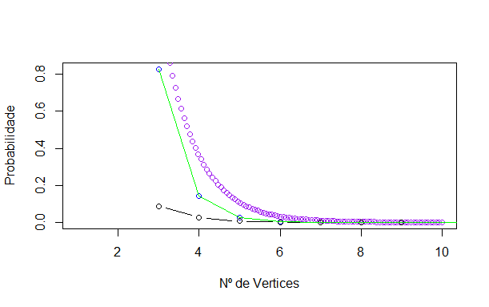

```{r setup, include=FALSE}
knitr::opts_chunk$set(echo = TRUE, cache = TRUE)
options(tinytex.verbose = TRUE)
```

```{r load_lib, include=FALSE, cache=FALSE}
source("EP_aux.R", encoding = 'utf-8')
library(igraph) 
N = 300 # mudando o tipo de matriz aumentou a eficiencia
ns = 6:12  # range de tamanho de matrizes para teste
prob = 0.4 # probabilidade de ligacao (gerar um aleatorio entre 0.25 e 0.75)
```


# Introdução

O trabalho se refere a estudar as curvas de distribuição para $T(v)$ e $C(v,w)$, onde **T** representa o caminho mais curto de retorno ao vértice *v* e **C** o caminho mais curto entre os vértices *v* e *w*. O modelo de Erdo-Rényi é utilizado para gerar os grafos aleátorios com *n* vértices e probabilidade *p* de ligação entre cada par de vértices.

## Modelo 2
O modelo escolhido para o teste foi usando conexões não direcionadas e preguiçoso. O fato de ser preguiçoso implica que existem conexões para continuar no mesmo vértice. Além disso fica determinado que cada connexão só pode ser usada uma unica vez para cada caminho testado, assim evita-se que a distribuição **T** tenha apenas valores 1 e 2. Como as conexões são aleatórias podem existir vértices isolados e também como não pode ser utilizado a mesma conexão para voltar podem existir valores de **T** e **C** que podemos considerar $\inf$.

# Metodologia
## Estimação das distribuições
Para o teste primeiro inicia-se uma matriz *A* representando com **TRUE** quando a ligação entre os vértices está presente e **FALSE** quando não há ligação. A linha *i* da matriz representa o vértice de saída e a coluna *j* representa o vértice de chegada. Como o modelo é preguiçoso pode existir **TRUE** na diagonal principal da matriz, e pelo fato das conexões não serem direcionadas a matriz é simétrica.

Exemplo de matriz de conexões para 7 vértices com probabilidade de conexão 0.4:
```{r matrix_example, echo=TRUE}
n = 7
A = generateMatrix(n, 0.4)
print(1*A) #1* para deixar em formato numerico

plot(graph_from_adjacency_matrix(A, mode = 'undirected', weighted = TRUE))
```

Para cada mariz gerada é testado para cada vértice o menor caminho de volta, usando uma busca em profundidade dos caminhos possíveis da matriz e armazenado o vetor com a contagem de cada valor para **T** encontrado. O mesmo é feito para cada combinação de vértices possíveis para encontrar os valores de **C**. Os caminhos podem ter tamanhos até $n$ e iremos considerar o valor $n+1$ como sendo infinito.

Exemplo de valores de $T(v)$ para cada vértice de **A**
```{r T_example, echo=TRUE}
for(i in 1:n) {
  Ti = findPath(i,i,A,0,n+1)
  cat(sprintf("T(%d) = %d\n",i, Ti))
}
```

Será gerado para cada tamanho de $n \in \{6,7,8,9,10,11,12\}$ uma amostra de $`r N`$ matrizes e feita uma contagem para cada valor de **T** encontrado. A distribuição é estimada tirando a média da contagem por $n * `r N`$. Assim:

$$\hat{P}(T=k) = \frac{1}{n*`r N`} \sum_{i=1}^{n*`r N`} \mathbbm{1}_{(T=k)}$$

Para a distribuição de *C* é usado processo similar mas como temos as combinações entre os pares serão estimados $n * n$  valores para cada matriz, assim:

$$\hat{P}(C=k) = \frac{1}{n^2 *`r N`} \sum_{i=1}^{n^2 *`r N`} \mathbbm{1}_{(C=k)}$$

## Tamanho da amostra
Para determinar um tamanho bom de amostra para a aproximação da estimação, fixamos $n = 8$ e geramos a distribuição e o gráfico para alguns tamanhos de amostra ($N \in \{25, 50, 75, 100, 150, 200, 250, ..., 750, 800\}$). Depois calculamos a soma das diferenças ao quadrado entre os valores de cada distribuição e colocamos em um gráfico. No gráfico pode ser verificado se houve convergência e com que tamanho de amostra podemos considerar a convergência.
$$erro = \sum_{i = 1}^{n+1} \big(P(T=k) - P'(T=k)\big)^2$$
onde $P(T=k)$ é a probabilidade para o tamando de amostra atual e $P'(T=k)$ a probabilidade da amostra anterior.

## Teste de aderência
Após determinar um função de densidade de probabilidade que define a distribuição para os valore de $P(T=k)$ e $P(C=k)$, usaremos um teste de aderência para validar a hipótese. Testamos a $H_0$: população segue distribuição proposta contra a $H_1$: população tem outra distribuição. Para ta usaremos a seguinte estatística de teste:
$$\chi^2 = \sum_{i=1}^{K}\frac{(O_{i} - E_{i})^2}{E_{i}}$$
Onde $O_{i}$ são as frequências observadas na simulação, $E_{i} = P(T=i) \times N$ a frequência esperada e $K$ representa a quantidade de pontos da distribuição. Assim $\chi^2$ tem uma distribuição chi-quadrada com $K-1$ graus de liberade.
Com o teste calculado definimos a região critica como $RC = (c, \infty)$ onde $P(\chi^2_{s-1} > c) = \alpha$, sendo $\alpha$ o nível de significância para o nosso teste.

Dessa forma após as simulações e escolhida uma distribuição provável que explique a frequencia observada, é feita a soma dos calculos das diferenças, e o resultado comparado com $c$. Se o valor calculado for maior que $c$ rejeitamos nossa hipótese $H_0$ com o nível de significância escolhido, e a distribuição selecionada não é aderente as observações. Mas se o valor calculado for menor que $c$ então não rejeitamos $H_0$ e podemos considerar que a variável aleatória $T$ tem a distribuição do modelo sugerido.

# Simulação
## Tamanho da amostra
Gráfico para vários tamanhos de amostra com $p = `r prob`$:

```{r tam_amostra, echo = FALSE}
v = testeAmostras(n = 8, c(25, 50, 75, 100, 150, 200, 250, 300, 350, 400, 450, 500, 550, 600, 650, 700, 750, 800), p = prob, silent = TRUE)
```
Pelo gráfico podemos considerar uma amostra com tamanho `r N` razoável para as estimações de distribuição.

## Distribuições para T

Valores estimados e gráficos da distribuição, usando `r N` amostras, e $p = `r prob`$

```{r gera_dist_T, echo = FALSE}
d = testeSamplesT(range_n = ns, sampleSz = N, p = prob, silent = TRUE, nographs = TRUE)
printGraficos(d)
```

## Proposta de distribuição proposta para T
Ao realizarmos os testes, percebemos que nossa distribuição aparenta ter caracteristicas e formas de algumas distribuições conhecidas, sendo elas: Poisson, Exponencial e Geométrica. Neste caso vamos tentar identificar qual distribuição é mais 'próxima' da nossa distribuição e quais são os melhores paramêtros da distribuição escolhida.


# Premissas iniciais:
Nossa simulação é um processo discreto, além disso realizamos algumas mudanças em nossas distribuições de T. Primeiramente, retiramos a observação 2 de nosso processo, porque o problema definido não permite que o tempo minimo de volta seja 2, assim: $O_{2} = 0$.Retiramos, também, a observação 1 porque, de fato, $P(O_{1}) = p$, pois o problema é definido para podermos voltar ao mesmo nó com probabilidade $p$ , fica bem definido assim $P(O_{1}) = p$ e por fim e não menos importante, retiramos $T_{inf}$ por ser um ponto degenerado na nossa distribuição esperada.

***

Caracteristicas da simulação:

* Número de vértices: `r d[[5]]$n`
* Número de repetições: `r N`
* Probabilidade de conexão entre vértices: `r prob`

***

A distribuição sem as observações citadas tem uma distribuição reescalada na forma. A escala foi modificada na forma $P(T=k|k \in \{3,4,5,6,7,8,9,10\})$, ou seja condicionamos as probabilidades aos valores de interesse.

```{r isolate_dist, echo = FALSE}
distT = d[[5]]$dadosAcum
nd = d[[5]]$n
dT = distT[3:nd]
dTp = dT / sum(dT)
dTP = dT / sum(distT)
#lambd = sum(1:length(dT) * dT)/sum(dT) 
#geo = 1/lambd
plot(c(NA,NA,dTp), x = 1:nd, col="blue", type = "b", xlab="T", ylab="Probabilidade")
grid(nx = NULL, ny = NULL, col = "darkgray", lty = "dotted", lwd = par("lwd"), equilogs = TRUE)
```


<!--  -->

### Parâmetros da distribuição:
Para encontrar os parametros das distribuição vamos usar as leis dos grandes números que diz que a média da amostra converge para a média da população quando o tamanho da amostra cresce, em outras palavras:
$$ \lim_{n->\infty}\hat{\mu_{n}} \rightarrow \mu $$

Usaremos estas premissas para encontrar os parâmetros da distribuição .
Sendo assim devemos conhecer a esperança da distribuição geométrica,poisson e exponêncial:

$$\begin{aligned}
E(X\sim Geo(p)) = \frac{1}{p} \\
E(X\sim Exp(\lambda)) = \lambda \\
E(X\sim Pois(\lambda)) = \lambda \\
\end{aligned}$$ 
A partir da simulação encontramos os parâmetros das distribuições como se segue:
```{r estimated_pars_T, echo=FALSE}
lambd = sum(1:length(dT) * dT)/sum(dT) 
geo = 1/lambd

```


Geométrica | Exponêncial | Poisson
------------- | ------------- | -------------
   E(x) = `r round(geo,3)`  |   E(X) = `r round(lambd,3)`    |   E(x) = `r round(lambd,3)` 
 
***


Realizando simulações com as premissas citadas e com os parâmetros encontrados obtemos os seguintes distribuições:

```{r calc_dist_T, echo=FALSE}
#CALCULAR AS DISTRIBUICOES
geom = dgeom(0:(nd-3),geo)
expo = dexp(0:(nd-2), lambd)
pois = dpois(0:(nd-2),lambd)
```


\begin{table}[ht]
\begin{tabular}{|c|c|c|c|c|c|c|c|c|}
\hline
\textbf{x}              & \textbf{3} & \textbf{4} & \textbf{5} & \textbf{6} & \textbf{7} & \textbf{8} & \textbf{9} & \textbf{10} \\ \hline
\textbf{Exponencial}    & `r sprintf("%.4f",expo[1])`     & `r sprintf("%.4f",expo[2])`     & `r sprintf("%.4f",expo[3])`     & `r sprintf("%.4f",expo[4])`     & `r sprintf("%.4f",expo[5])`     & `r sprintf("%.4f",expo[6])`     & `r sprintf("%.2e",expo[7])`     & `r sprintf("%.2e",expo[8])`    \\ \hline
\textbf{Geométrica}     & `r sprintf("%.4f",geom[1])`     & `r sprintf("%.4f",geom[2])`     & `r sprintf("%.4f",geom[3])`     & `r sprintf("%.4f",geom[4])`     & `r sprintf("%.4f",geom[5])`     & `r sprintf("%.4f",geom[6])`     & `r sprintf("%.2e",geom[7])`   & `r sprintf("%.4e",geom[8])`    \\ \hline
\textbf{Poisson}        & `r sprintf("%.4f",pois[1])`     & `r sprintf("%.4f",pois[2])`     & `r sprintf("%.4f",pois[3])`     & `r sprintf("%.4f",pois[4])`     & `r sprintf("%.4f",pois[5])`     & `r sprintf("%.4f",pois[6])`     & `r sprintf("%.2e",pois[7])`   & `r sprintf("%.4e",pois[8])`    \\ \hline
\textbf{Dist. Simulada} & `r sprintf("%.4f",dTp[1])`     & `r sprintf("%.4f",dTp[2])`     & `r sprintf("%.4f",dTp[3])`     & `r sprintf("%.4f",dTp[4])`     & `r sprintf("%.4f",dTp[5])`     & `r sprintf("%.4f",dTp[6])`          & `r sprintf("%.4f",dTp[7])`          & `r sprintf("%.4f",dTp[8])`           \\ \hline
\end{tabular}
\end{table}

Para chegar nos resultados da tabela acima foram utilizados o seguinte calcúlos:  $$E(T) = \sum_{i=1}^{n}T_{i}*P(T=i) \rightarrow p = \frac{1}{E(T)}$$ para cada uma das distribuições.

A seguir o resultado de cada uma das distribuições com os parâmetros encontrados:

```{r with_dist, echo=FALSE}
#lambd = sum(1:length(dT) * dT)/sum(dT)
#geo = 1/lambd
plot(c(NA,NA,dTp), x = 1:nd, col="blue", type = "b", xlab="T", ylab="Probabilidade")
curve(dexp(x-3, lambd), xlim=c(3,nd), col = "purple", type = "b", add=T)
lines(dpois(c(NA,NA,3:(nd-1)), lambd ), col = "black", type = "b")
lines(dgeom(0:(nd-2),geo), x = 3:(nd+1), col = "green", type = "l")
grid(nx = NULL, ny = NULL, col = "darkgray", lty = "dotted", lwd = par("lwd"), equilogs = TRUE)
legend(x = "topright", col = c("blue", "purple", "green","black"), 
         legend = c("Simulado", "Dist. Exponencial", "Dist. Geométrica", "Dist. Poisson"),
         fill = c("blue", "purple", "green", "black"))
```


<!-- 

Legenda:
Pontos roxos: Distribuição Exponencial
Pontos Azuis: Nossa distribuição Simulada 
Pontos Verdes: Distribuição Geométrica 
Pontos Pretos: Distribuição Poisson --> 


A partir destas distribuições tomamos aquela que possui menor distância entre a distribuição simulada e as distribuições propostas.

Como pode ser visto na imagem acima a distribuição que será assumida será a Geométrica, pois é a que se aproxima mais da nossa distribuição simulada.

Em seguida iremos realizar o teste de $\chi^2$ para avaliarmos se estamos cometendo o erro na escolha da distruibuição. 

## Distribuição reescalada e distribuição proposta
Queremos agora, voltar para distribuição original a partir da distribuição reescalada. Veja abaixo ambas as distribuição:

```{r dist_scaled_and_normal, echo=FALSE}

plot(c(NA,NA,dTp), x = 1:nd, col="blue", type = "b", xlab="T", ylab="Probabilidade")
lines(c(NA,NA,dTP), col = "darkgray", type = "b")
grid(nx = NULL, ny = NULL, col = "darkgray", lty = "dotted", lwd = par("lwd"), equilogs = TRUE)
legend(x = "topright", col = c("blue", "darkgray"), 
         legend = c("Dist. reescalada", "Dist. original"),
         fill = c("blue", "darkgray"))
```

<!--  

Legenda
Azul: Distribuição da simulação reescalada
Cinza: Distribuição da simulação original -->

Foi necessario reescalar a distribuição e retirar dados pois a mesma iria interferir na comparação com uma distribuição já conhecida, que neste caso foi a geométrica. Portanto, temos que voltar a distribuição reescalada para distribuição original.

```{r}
#n = 10
#dT = distT[3:n] ##Retiramos os nós 1, 2 e inf (Premissa)
#dTp = dT / sum(dT) ##Distribuição reescalada (Azul)
#dTP = dT / sum(distT) ##Distribuição Original considerando todos os valores.
```

Como queremos sair da distribuição Azul(reescalada) para a distribuição cinza(orginal), devemos multiplicar por um fator $(1-p-T_{\infty})$:

<!-- 

$$dTP[k] = \frac{dTp[k]\times \sum_{i=1}^{n}dT[i]}{\sum_{i=1}^{n}distT}, k=1,2,..,n$$
-->

Realizando esses passos podemos encontrar a distribuição reescalada para a forma original:

<!--  --> 

Agora é possivel reeconstruir toda a distribuição da simulação,porque sabe-se que $P(T=2)=0$ e $P(T=1) = p = `r prob`$ e que $P(T = ' \infty ') = 1 - P(T<=n)$, todas as informações foram citadas na seção de premissas.

E finalmente temos nossa distribuição reconstruida completamente.

```{r dist_completa_T, echo=FALSE, fig.cap="Distribuição completa com base na distribuição geométrica"}
plot(c(prob,0,dTP,1-sum(dTP)-prob), x = 1:(nd+1), col="green", type = "b", xlab="T", ylab="Probabilidade")
lines(c(NA,NA,dTP,NA), col = "darkgray", type = "b")
grid(nx = NULL, ny = NULL, col = "darkgray", lty = "dotted", lwd = par("lwd"), equilogs = TRUE)

```


<!--  -->

A distribuição proposta é:
$$
T \sim \left\{ 
              \begin{array}{ll} 
                P(T=1) = p\\
                P(T=2) = 0\\
                P(T=k) \sim Geo(g) * (1 - p - T_{\infty}), \text{usando valor k-3 para } k \in \{3,4,..,n\}\\
                P(T=\infty) = 1 - p - \sum_{i=3}^{n}P(T=i)
              \end{array}
        \right.
$$
Sendo $g = 1 / E[T-2]$ para $T \in \{3,4,5,...,n\}$, ou seja, é a média da amostra observada do ponto 3 em diante, porém deslocados em duas unidades.
\newpage

## Teste de aderência:
Com nossa função proposta em mãos, podemos realizar o teste $\chi^2$ com $\alpha = 5$% de tolerância. Para avaliarmos se estamos ou não comentendo o erro de escolher a distribuição Geométrica com parâmetro ($p=`r geo`$).


$$ \chi^2 = \sum_{i=1}^{K}\frac{(O_{i} - E_{i})^2}{E_{i}} $$
Onde $O_{i}$ são as frequências observadas na simulação e $E_{i} = P(T=i)\times N$ com $T\sim (Geometrica)$. K representa o número de repetições.

## Teste de aderência para T

 

**Hipótese nula:** Distribuição proposta seja igual a distribuição T simulada.

**Hipótese alternativa:**  Distribuição proposta seja diferente da distribuição T simulada.

Nossa região critica para $\alpha = 5\%$ é $RC=\{x:\mathbb{R}, (`r qchisq(0.95, 9)`,+\infty) \}$ 

```{r teste_adere_T, echo=FALSE, fig.cap="Proposta x Simulada"} 
# proposta
Tinf = distT[11]/sum(distT)
geo_prop = dgeom(0:(nd-3),geo)*(1-prob-Tinf)
prop = c(prob,0,geo_prop,1-prob-sum(geo_prop))
obs = distT/sum(distT)

# plota a simulada
plot(obs, x = 1:(nd+1), col="green", type = "b", xlab="T", ylab="Probabilidade")
# plota a proposta
lines(prop, col = "blue", type = "b")
grid(nx = NULL, ny = NULL, col = "darkgray", lty = "dotted", lwd = par("lwd"), equilogs = TRUE)
legend(x = "topright", col = c("green", "blue"), 
         legend = c("Dist. simulada", "Dist. proposta"),
         fill = c("green", "blue"))

chi2 = sum((obs-prop)^2 / prop, na.rm=TRUE)
```


O valor de $\chi^2(s=(9)) = `r chi2`$. Sendo assim assumimos que nossa distribuição proposta tem boa aderência com significância de $\alpha = 5\%$. Como nosso $\chi^2 \notin RC$ sendo assim não rejeitamos a nossa hipótese nula.

Notas: Consideramos 9 graus de liberdade pois retiramos $T=2$


## Distribuições para C
Valores estimados e gráficos da distribuição. Como a quantidade de testes aumenta em $n$ vezes para a distribuiçao C, reduzimos a quantidade de matrizes geradas pela metade, e portanto usamos uma amostra de tamanho `r N/2` com $p = `r prob`$.

```{r gera_dist_C, echo = FALSE}
e = testeSamplesC(range = ns, sampleSz = N/2, p = prob, silent = TRUE, nographs = TRUE)
printGraficos(e)
```


## Premissas
De forma análoga a distribuição de T, retiramos desta vez apenas a observação 1, ou seja $C(v,v') = 1$, porque $P(C=1) = p = `r prob`$ e a observação 11 ($C_{\infty}$).

***

Caracteristicas da simulação:

* Número de vértices: `r e[[5]]$n`
* Número de repetições: `r N/2`
* Probabilidade de conexão entre vértices: `r prob`

***

## Distribuição para C
Podemos seguir o mesmo raciocinio da distribuição T para inferirmos sobre a distribuição C. Portanto podemos calcular diretamente:
$$E(X \sim Geo(p)) = \frac{1}{p}$$
E verificar se essa distribuição se aproxima da nossa distribuição simulada.
Veja inicialmente, que a distribuição para C com as premissas citadas possui o seguinte gráfico:

```{r simula_C, echo=FALSE}
distC = e[[5]]$dadosAcum
nc = e[[5]]$n
dC = distC[2:nc]
dCp = dC / sum(dC)
dCP = dC / sum(distC)
plot(c(NA,dCp), x = 1:nc, col="blue", type = "b", xlab="C", ylab="Probabilidade")
grid(nx = NULL, ny = NULL, col = "darkgray", lty = "dotted", lwd = par("lwd"), equilogs = TRUE)
```


<!--  -->

```{r estimated_pars_C, echo=FALSE}
lambdC = sum(1:length(dC) * dC)/sum(dC) 
geoC = 1/lambdC
```


Realizando as simulações conseguimos encontrar o parâmetro p por meio da esperança 
$$E(X \sim Geo(p)) = `r lambdC` = \frac{1}{p} \rightarrow p = `r geoC`$$

Assim podemos comparar a distribuição simulada com a distribuição geométrica com paramêtro $p = `r geoC`$ e a exponêncial com $\lambda= `r lambdC`$. Obtemos assim os seguintes gráficos:

```{r with_dist_C, echo=FALSE}
plot(c(NA,dCp), x = 1:nc, col="blue", ylim=c(0,0.8), type = "b", xlab="C", ylab="Probabilidade")
curve(dexp(x-2, lambdC), xlim=c(2,nc), col = "purple", type = "b", add=T)
lines(dgeom(0:(nc-2),geoC), x = 2:nc, col = "green", type = "b")
grid(nx = NULL, ny = NULL, col = "darkgray", lty = "dotted", lwd = par("lwd"), equilogs = TRUE)
legend(x = "topright", col = c("blue", "purple", "green"), 
         legend = c("Simulado", "Dist. Exponencial", "Dist. Geométrica"),
         fill = c("blue", "purple", "green"))
```

<!-- 

Distribuição roxa: Exponêncial
Distribuição verde: Distribuição Geométrica
Distribuição Azul: Distribuição simulada -->

Tomamos como hipótese de distribuição aquela que obteve a menor distância com a distribuição simulada, que neste caso foi a distribuição Geométrica.

## Distribuição reescalada e distribuição proposta:
Queremos agora voltar a distribuição original da simulação, ou seja, sem retirar as observações 1 e 11 como haviamos feito anteriormente.Seguindo o mesmo raciocinio da distribuição T.

<!--  -->

Usando a mesma metodologia que na distribuição C, podemos reescalar a distribuição geométrica para ficar compatível com a simulada. É possivel reeconstruir toda a distribuição da simulação,porque sabe-se que $P(C=1) = p = `r prob`$ e que $P(C = \infty) = 1 - P(C<=n)$

E finalmente temos nossa distribuição reconstruida completamente.

```{r dist_completa_C, echo=FALSE, fig.cap="Distribuição completa com base na distribuição geométrica"}
plot(c(prob,dCP,1-sum(dCP)-prob), x = 1:(nd+1), col="green", type = "b", xlab="C", ylab="Probabilidade")
lines(c(NA,dCP,NA), col = "darkgray", type = "b")
grid(nx = NULL, ny = NULL, col = "darkgray", lty = "dotted", lwd = par("lwd"), equilogs = TRUE)

```


A distribuição proposta é:
$$
C \sim \left\{ 
              \begin{array}{ll} 
                P(C=1) = p\\
                P(C=k) \sim Geo(g) * (1 - p - C_{\infty}), \text{usando valor k-2 para } k \in \{2,4,..,n\}\\
                P(C=\infty) = 1 - p - \sum_{i=2}^{n}P(C=i)
              \end{array}
        \right.
$$
Sendo $g = 1 / E[C-1]$ para $C \in \{2,4,5,...,n\}$, ou seja, é a média da amostra observada do ponto 2 em diante, porém deslocados em uma unidade.

<!-- 

E agora podemos reconstrui a nossa distribuição orginal, sabendo que a primeira observação ocorre com probabilidade p = 0.4 e $P(C= 11) = 1 - P(C <= 10)$
 -->


## Teste de aderência para C

Tendo como hipótese nossa dsitribuição geométrica podemos realizar o teste de aderência para verificar a adequabilidade da distribuição simulada com a distribuição proposta.

De modo análogo podemos calcular: $\chi^2$ com $\alpha = 5$% de significância, para avaliarmos se estamos ou não comentendo o erro de escolher a distribuição proposta.


$$ \chi^2 = \sum_{i=1}^{K}\frac{(O_{i} - E_{i})^2}{E_{i}} $$
Podemos definir nossas hipóteses para este modelo da seguinte forma:

**Hipótese nula:** Distribuição proposta seja igual a distribuição C simulada.

**Hipótese alternativa:**  Distribuição proposta seja diferente da distribuição C simulada.
Nossa região critica para $\alpha = 5\%$ é $RC=\{x:\mathbb{R}, (`r qchisq(0.95, 10)`,+\infty) \}$

```{r teste_adere_C, echo=FALSE, fig.cap="Proposta x Simulada"} 
# proposta
Cinf = distC[11]/sum(distC)
geo_propC = dgeom(0:(nc-2),geoC)*(1-prob-Cinf)
propC = c(prob,geo_propC,1-prob-sum(geo_propC))
obsC = distC/sum(distC)

# plota a simulada
plot(obsC, x = 1:(nc+1), ylim=c(0,0.45), col="green", type = "b", xlab="C", ylab="Probabilidade")
# plota a proposta
lines(propC, col = "blue", type = "b")
grid(nx = NULL, ny = NULL, col = "darkgray", lty = "dotted", lwd = par("lwd"), equilogs = TRUE)
legend(x = "topright", col = c("green", "blue"), 
         legend = c("Dist. simulada", "Dist. proposta"),
         fill = c("green", "blue"))

chi2C = sum((obsC-propC)^2 / propC, na.rm=TRUE)
```


O valor de $\chi^2(s=(10)) = `r chi2C`$. Sendo assim assumimos que nossa distribuição proposta tem boa aderência com significância de $\alpha = 5\%$. Como nosso $\chi^2 \notin RC$ sendo assim não rejeitamos a nossa hipótese nula.


Notas: Consideramos 10 graus de liberdade pois temos 9 elementos comparados.


